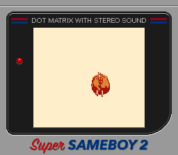
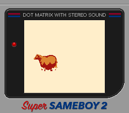

# Fat Horse - Game Boy Color Homebrew

A Game Boy Color homebrew project featuring a controllable fat horse with directional movement and sound effects. Built entirely in assembly language using RGBDS.

<!-- markdownlint-disable MD036 -->


*Front view of the fat horse sprite displayed in SameBoy emulator*



*Side view of the fat horse sprite displayed in SameBoy emulator*
<!-- markdownlint-disable MD036 -->

## Features

- **Directional Horse Sprite**: A fat horse with stubby legs that faces four different directions
- **D-pad Movement**: Move the horse around the screen and change its facing direction
- **Sound Effects**:
  - Press A button for neigh/whinny sound
  - Press B button for snort/blow sound
- **Boundary Checking**: Horse stays within screen bounds
- **Sprite-based Graphics**: Uses Game Boy Color's hardware sprite system for smooth movement

## Controls

- **D-pad**: Move horse and change direction
  - UP: Move up and face up
  - DOWN: Move down and face down  
  - LEFT: Move left and face left
  - RIGHT: Move right and face right
- **A Button**: Play neigh sound
- **B Button**: Play snort sound

## Technical Details

### Graphics System

- **48×48 pixel horse sprite** broken into 36 individual 8×8 sprites (6×6 grid)
- **Four directional sprites** loaded simultaneously into different VRAM regions
- **Custom color palette** optimized for blue-green horse graphics
- **Hardware sprite positioning** for pixel-perfect movement

### Memory Layout

- Horse Down: VRAM tiles 0-35 ($8000-$823F)
- Horse Up: VRAM tiles 36-71 ($8240-$847F)  
- Horse Left: VRAM tiles 72-107 ($8480-$86BF)
- Horse Right: VRAM tiles 108-143 ($86C0-$88FF)

### Sound System

- **Channel 1**: Neigh sound using frequency sweep and pulse wave
- **Channel 4**: Snort sound using noise generator
- **Proper APU initialization** with volume and channel routing

### Assembly Programming Techniques

- **Memory management**: Efficient VRAM usage and sprite positioning
- **Input handling**: D-pad and button reading with debouncing
- **Boundary checking**: Prevents horse from moving off-screen
- **Sound synthesis**: Direct Game Boy sound chip programming
- **Nested loops**: Optimized sprite setup using row/column iteration

## Building

### Requirements

- [RGBDS](https://rgbds.gbdev.io/) (Game Boy development tools)
- Make utility
- Game Boy Color emulator (SameBoy recommended)

### Build Commands

```bash
# Build ROM
make

# Clean build files  
make clean

# Build and run in SameBoy
make run
```

### Project Structure

``` bash
fat-horse-gbc/
├── main.asm           # Main assembly source code
├── Makefile          # Build configuration
├── horse-down.2bpp   # Down-facing horse graphics
├── horse-left.2bpp   # Left-facing horse graphics  
├── horse-right.2bpp  # Right-facing horse graphics
├── horse-up.2bpp     # Up-facing horse graphics
├── fat-horse.gbc     # Output ROM file (generated)
├── main.o            # Assembled object file (generated)
├── fat-horse.map     # Memory map file (generated)
└── fat-horse.sym     # Symbol table file (generated)
```

## Graphics Conversion

The horse sprites were converted from 48×48 PNG files using rgbgfx:

```bash
# Convert PNG to Game Boy Color format
rgbgfx -o horse-down.2bpp horse-down.png
rgbgfx -o horse-left.2bpp horse-left.png
rgbgfx -o horse-right.2bpp horse-right.png  
rgbgfx -o horse-up.2bpp horse-up.png
```

Each .2bpp file contains 576 bytes (36 tiles × 16 bytes per tile).

## Hardware Compatibility

- **Game Boy Color**: Full compatibility with color support
- **Super Game Boy**: Compatible (monochrome)
- **Game Boy Advance**: Backward compatible
- **Original Game Boy**: Compatible (monochrome)

## Code Highlights

### Sprite Management

The game uses a sophisticated sprite system that loads all four horse directions into VRAM simultaneously, then dynamically updates which tiles are displayed based on the current direction.

### Sound Programming

Direct manipulation of the Game Boy's APU (Audio Processing Unit) registers creates authentic 8-bit sound effects using frequency sweeps and noise generation.

### Assembly Optimization

Hand-optimized assembly code with careful register usage, efficient memory access patterns, and minimal CPU cycles for smooth 60fps gameplay.

## Educational Value

This project demonstrates:

- **Low-level hardware programming** on authentic 8-bit architecture
- **Graphics pipeline** from PNG conversion to hardware sprite display
- **Sound synthesis** using dedicated audio hardware  
- **Memory management** in constrained embedded systems
- **Input handling** and real-time user interaction
- **Cross-platform development** targeting vintage gaming hardware

## License

This is a homebrew/educational project. The code is provided as-is for learning purposes.

## Development Notes

Built as a portfolio project to demonstrate Game Boy Color assembly programming skills, graphics conversion workflows, and understanding of retro gaming hardware architecture. The project showcases both technical implementation and creative game design within the constraints of 1990s handheld gaming technology.

## Future Improvements

### Graphics & Animation

- **Walking animation**: Add 2-frame leg animation when horse moves
- **Background tiles**: Add simple grass/terrain background graphics
- **Visual effects**: Screen shake on boundary collision or sound effects
- **Multiple sprites**: Add other animals or objects to interact with

### Gameplay Features  

- **Collectible items**: Add sprites to collect for points/goals
- **Simple AI**: Add moving NPCs or obstacles to avoid
- **Game states**: Title screen, pause menu, game over screen
- **Score system**: Track movement, time, or collected items

### Technical Enhancements

- **Scroll engine**: Larger world that scrolls as horse moves
- **Bank switching**: Support larger ROM sizes with multiple banks
- **Save system**: High scores or progress using battery-backed SRAM  
- **Music system**: Background music using remaining sound channels
- **Optimization**: Further assembly optimization for smoother performance

### Hardware Features

- **Super Game Boy support**: Custom borders and enhanced colors
- **Game Boy Printer**: Print horse screenshots or stats
- **Link cable**: Two-player modes or data exchange
- **Rumble support**: Vibration feedback on Game Boy Color peripherals

### Development Tools

- **Automated builds**: CI/CD pipeline for ROM generation
- **Graphics pipeline**: Automated PNG to .2bpp conversion scripts
- **Debug builds**: Version with debug symbols and profiling
- **Documentation**: In-code documentation generation tools

### Code Quality

- **Modularization**: Split code into multiple .asm files by function
- **Constants file**: Centralize magic numbers and memory addresses
- **Error handling**: Robust input validation and error recovery
- **Unit testing**: Assembly-level testing framework for critical functions

These improvements would transform the current tech demo into a full-featured Game Boy Color game while maintaining the educational value of the low-level programming approach.
